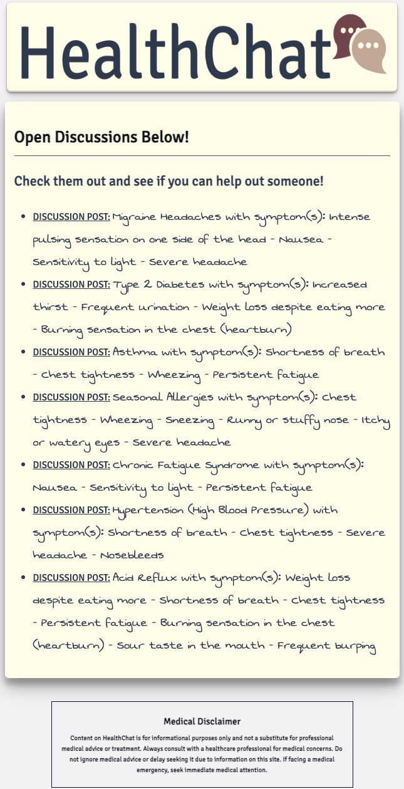

# HealthChat

 HealthChat is designed to bridge the gap between individuals and health information, enabling users to discuss, share, and learn about various health concerns in a supportive community environment. This platform serves as a comprehensive hub for real-time health discussions, where users can detail their symptoms, express their health concerns, and engage with others who may have similar experiences or valuable insights. 
 
 With its intuitive interface, users can easily navigate through different health topics, join relevant discussions, and even initiate their own threads about particular concerns. Furthermore, HealthChat aids in fostering a transparent and informative dialogue about health, allowing users to make more informed decisions and potentially uncover insights about their health that they might not have realized.
 
 HealthChat is not only a platform for individuals seeking answers but also a space for health professionals and enthusiasts to share their knowledge, provide guidance, and contribute to the overall well-being of the community. Whether you're looking to understand a specific symptom, share a health journey, or offer expertise, HealthChat provides the space for all these interactions.

## [Start a Discussion](https://healthchat.fly.dev/)

## Features
- User authentication.
- CRUD operations for discussions and symptoms.
- Nested replies within discussions.
- Ability to tag symptoms within discussions.
- Role-based features (e.g., doctors).

### [Trello Planning Material](https://trello.com/b/quTDOo8A/healthchat)

## Screenshots
### HealthChat Logo:

### A View of the Discussion Posts: 

## Technologies Used
- JavaScript
- CSS
- EJS
- Mongoose
- Node.js
- MongoDB
- HTML
- Git
- Express

## Attributions
- [Favicon Generator](https://favicon.io/favicon-generator/)
- [Logo creator](https://www.canva.com/logos/templates/)
- [CSS Button Animator](https://getcssscan.com/css-buttons-examples?ref=beautifulboxshadow-bottom)
- [CSS Checkbox Animator](https://getcssscan.com/css-checkboxes-examples?ref=beautifulboxshadow-bottom)

## Future Goals
- [ ] Add a Profile section that includes the emotional well-being of users
- [ ] Add a severity scale for the symptoms
- [ ] Create a helpful checkbox that the discussion creator and other users can check if the reply was helpful
- [ ] Make it compatible for mobile devices
- [ ] Have the possibility for more languages to promote accessibility 

